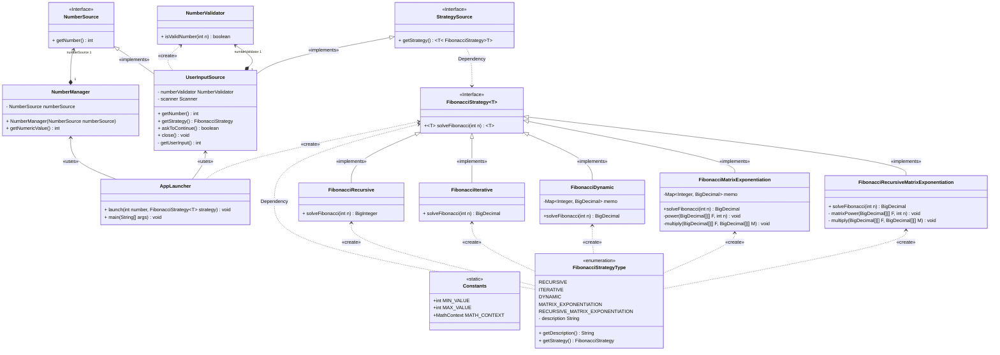
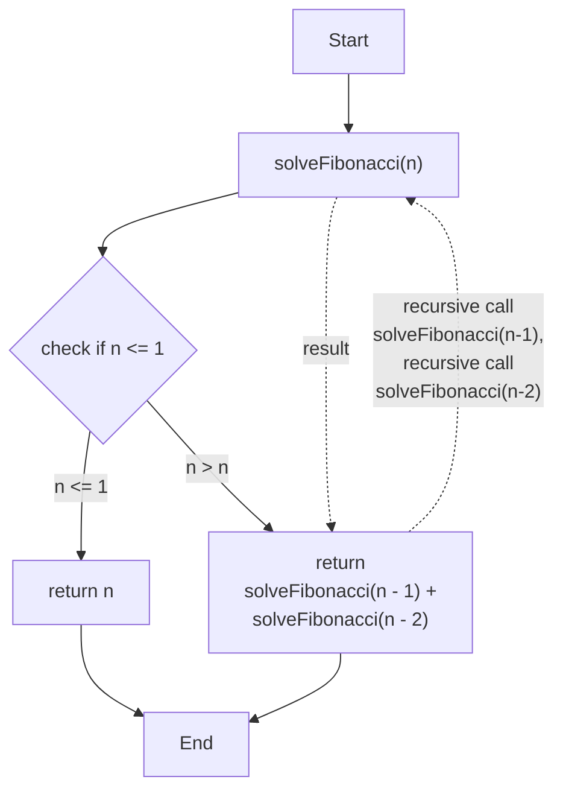
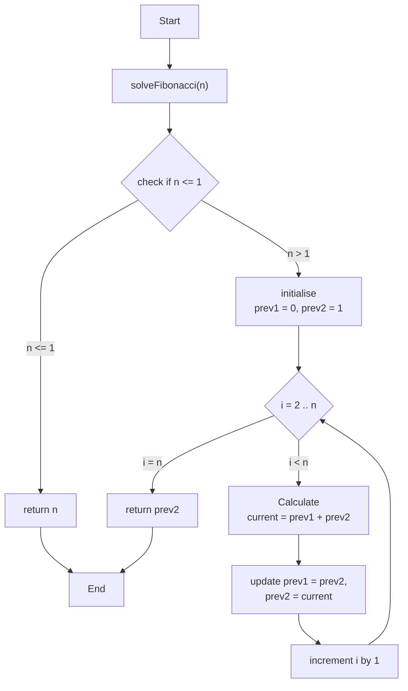
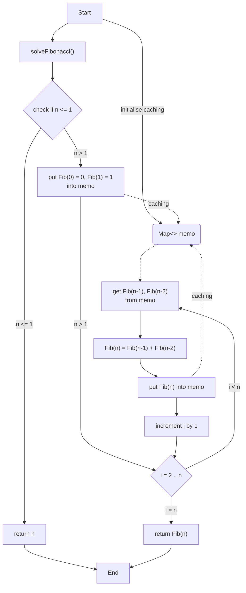
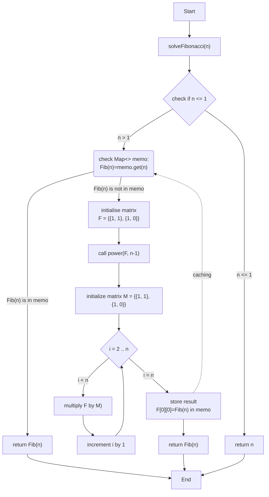
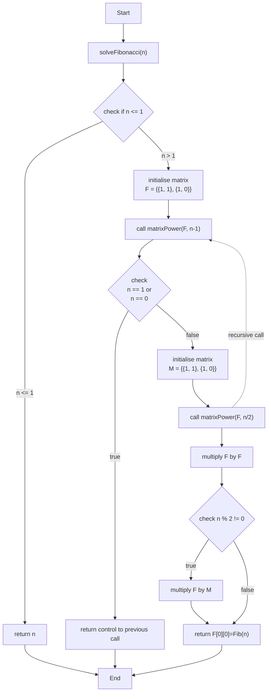

# Fibonacci Calculator

This Java project is a flexible command-line application designed to compute Fibonacci numbers using various algorithms. The project is built to demonstrate different approaches to solving the Fibonacci sequence problem. This is solution for GoIT Academy Module 2.05 [Algorithm Complexity] hometask.

## Project Structure



## Key Features

### Multiple Independent Strategies
- **[Recursive](#recursive-approach-to-fibonacci-sequence)**: A simple, straightforward approach, ideal for educational purposes and small Fibonacci numbers (up to 50). This method, while easy to understand, is not suitable for large numbers due to its exponential time complexity.

- **[Iterative](#iterative-approach-to-fibonacci-sequence)**: Efficient for medium-sized Fibonacci numbers (up to 1 billion). This method has a linear time complexity and constant space complexity, making it faster and more memory-efficient than the recursive method.

- **[Dynamic Programming](#dynamic-programming-with-bounded-memoization-for-fibonacci-sequence)**: Suitable for calculating Fibonacci numbers up to approximately 500 million. It uses memoization to store intermediate results, reducing the number of calculations and significantly improving performance.

- **[Matrix Exponentiation](#matrix-exponentiation-for-fibonacci-sequence)**: Optimal for large Fibonacci numbers up to the maximum integer value. This method has a logarithmic time complexity, making it highly efficient for very large inputs.

- **[Recursive Matrix Exponentiation](#matrix-exponentiation-with-recursive-divide-and-conquer-approach)**: Combines the efficiency of matrix exponentiation with recursion to handle extremely large Fibonacci numbers with maximum precision. This approach is ideal for scenarios requiring high-performance calculations over a wide range of inputs.

### High Precision with Calculation of Large Numbers in Fibonacci Sequence
- **BigInteger and BigDecimal Support**: The project utilizes `BigInteger` and `BigDecimal` classes to handle extremely large Fibonacci numbers and ensure precise calculations, even when the numbers exceed the storage capacity of primitive data types like `int` or `long`.

- **Optimized Storage**: The use of `BigInteger` and `BigDecimal` allows the program to store and manipulate large numbers without losing precision, making it suitable for scientific and financial applications where exact results are critical.

### Precision-Dependent Calculations
- The precision of the calculations can be configured using `MathContext`, allowing the user to define the level of precision required for the `BigDecimal` operations. This feature is particularly useful for applications requiring fine-tuned precision control.

### Performance Metrics
- **Execution Time Logging**: The application logs the time taken to compute each Fibonacci number, helping users understand the performance implications of each strategy. This is particularly useful for comparing the efficiency of different algorithms.
- **Benchmarking with JMH**: The project includes benchmarks using the Java Microbenchmark Harness (JMH) to measure and compare the performance of various Fibonacci implementations. The benchmarks provide detailed metrics such as execution time, garbage collection rates, and memory usage, offering deeper insights into the performance characteristics of each algorithm.
### Interactive User Interface
- The application prompts users to enter a number and select a calculation strategy, making it easy to use and experiment with different approaches.

## Usage

### Steps to Build

To build the project, follow these steps:

1. **Clone the repository**:
```shell
git clone git@github.com:ruslanaprus/goit-academy-dev-hw05.git
cd goit-academy-dev-hw05
```
2. **Build the project**:
```shell
./gradlew clean build
```
This command will use the gradle wrapper to ensure that the correct version of Gradle is used.

### Running the Application
After creating the fat JAR, you can run the application using the following command:
```shell
java -jar build/libs/fibonacci.jar
```

This will execute the main method in `AppLauncher.java`, and you should see the prompt to enter the number.

### Follow the Prompts
1. Enter the number for which you want to calculate the Fibonacci value.
2. Choose a Fibonacci calculation strategy from the provided options.
3. View the result along with the time taken to compute it.
4. Decide whether to perform another calculation or exit the program.

### Benchmarking with JMH

This project evaluates different implementations of the Fibonacci sequence using the Java Microbenchmark Harness (JMH). The setup is managed with Gradle, and the benchmarks are configured to assess performance metrics such as execution time and garbage collection overhead.

To run the benchmarks, use the JMH task by executing the following command:
```shell
./gradlew jmh
```

This will execute the benchmarks for the specified Fibonacci implementations, and the results will be saved as a CSV file located at `build/reports/jmh/result.csv`. The `result.csv` file will include performance data such as execution time and other profiled metrics.

To save the report as a JSON file, modify the JMH task configuration in the `build.gradle` file:
```shell
def resultFile = new File((File) project.reportsDir, 'jmh/result.json')
args '-rf', 'json'
```

Key metrics in the report include:

1. **`Score`**: The main performance metric of the benchmark. In `thrpt` mode, it represents the number of operations performed per millisecond (ops/ms).
2. **`gc.alloc.rate`**: The memory allocation rate during the benchmark, measured in megabytes per second (MB/sec). This indicates the amount of memory being used by the program.
3. **`gc.alloc.rate.norm`**: The normalised allocation rate, measured in bytes per operation (B/op). It indicates the average number of bytes allocated per Fibonacci calculation.
4. **`gc.count`**: The number of garbage collection events that occurred during the benchmark. This shows how frequently the JVM's garbage collector was triggered.
5. **`gc.time`**: The total time spent on garbage collection, measured in milliseconds (ms). This indicates how much time the JVM used to clean up unused objects.

## <u>Description of Implemented Algorithms</u>:

## Recursive Approach to Fibonacci Sequence

- **Time complexity**: `O(2^n)`
- **Space complexity**: `O(n)`

The primary approach used here is recursion, where the function calls itself to break down the problem into smaller subproblems. The algorithm is a basic implementation that demonstrates the concept of recursion by calculating Fibonacci numbers through repeated function calls. It's an illustrative example of recursion but not an efficient one for large inputs.
- Base Case: The function checks if `n` is less than or equal to 1 and returns the result directly. This operation takes constant time - O(1).
- Recursive Case: The number of operations required to compute the `n`-th Fibonacci number doubles with each additional level in the recursion tree. This is because each call to `solveFibonacci(n)` results in two more calls for `solveFibonacci(n - 1)` and `solveFibonacci(n - 2)`. Therefore, the time complexity of the `solveFibonacci` function in this case is `O(2^n)`.

The space complexity is determined by the maximum depth of the recursion tree. In the worst case, the maximum depth of the recursion is `n`, since each recursive call decreases `n` by 1.



## Iterative Approach to Fibonacci Sequence

- **Time complexity**: `O(n)`
- **Space complexity**: `O(1)`

The algorithm is an efficient implementation that calculates Fibonacci numbers iteratively, avoiding the exponential time complexity and stack overhead of the recursive approach. This makes it suitable for computing large Fibonacci numbers efficiently.

- Base Case: The function checks if `n` is less than or equal to 1 and returns the result directly. This operation takes constant time - `O(1)`.
- Loop: The for loop runs from `i = 2` to `i = n`, which means it iterates `n−1` times. Each iteration involves a constant amount of work — specifically, adding two `BigDecimal` numbers and performing some assignments. 

Since the loop iterates `O(n)` times and each iteration does `O(1)` work, the overall time complexity is `O(n)`.

The algorithm uses a constant number of `BigDecimal` variables (`prev1`, `prev2`, and `current`). The space required by these variables does not depend on `n`. It remains constant regardless of the size of `n`.
Unlike the recursive approach, so there's no additional space required for a call stack. Thus, the space complexity is `O(1)`.


## Dynamic Programming with Bounded Memoization for Fibonacci Sequence

- **Time complexity**: `O(n)`
- **Space complexity**: `O(1)`

This algorithm uses dynamic programming with memoization. However, due to the limit imposed on the memoization map size, it mimics the behavior of an iterative approach with space optimization, where only a few recent Fibonacci numbers are stored. By limiting the map size, the algorithm keeps space usage minimal, similar to a purely iterative approach with constant space complexity, which also allows to calculate Fibonacci number for large index `n`.

- Base Case: The function checks if `n` is less than or equal to 1 and returns the result directly. This operation takes constant time - `O(1)`.
- Loop: The for loop runs from `i = 2` to `i = n`, which means it iterates `n−1` times. Each iteration involves: Retrieving values from the `memo` map (which is typically `O(1)` for a `LinkedHashMap`). Performing an addition operation on `BigDecimal` numbers (which takes `O(1)` time assuming the number of digits in the Fibonacci numbers remains reasonably small).

Since the loop iterates `O(n)` times and each iteration does `O(1)` work, the overall time complexity is `O(n)`.

The space complexity - `O(1)`,  is determined by the amount of memory used by the algorithm.
- Memoization Map: The map `memo` is used to store intermediate Fibonacci values. However, due to the override of the `removeEldestEntry` method, the map can store at most 5 entries at any time. This means the space used by the map is constant, `O(1)`, because the size of the map does not grow with `n`.
- Other Variables: Apart from the memoization map, the algorithm uses a constant number of variables (`previousFib`, `twoStepsBackFib`) that do not depend on `n` and hence contribute to constant space.



## Matrix Exponentiation for Fibonacci Sequence

- **Time complexity**: `O(n)`
- **Space complexity**: `O(1)`

This algorithm uses matrix exponentiation to compute the n-th Fibonacci number efficiently in linear time.

- Base Case: If `n <= 1`, the function returns the result directly in `O(1)` time.
- Memoization Check: The function checks a `memo` map for precomputed results in `O(1)` time.
- Matrix Exponentiation: The core is raising a 2x2 matrix to the power of `n-1` using `power(F, n-1)`. The multiplication is done n-1 times, each in `O(1)` for fixed-size matrices, leading to `O(n)` overall time complexity.

The space complexity remains `O(1)` due to:

- Memoization Map: Stores a limited number of values.
- Matrix Storage: Uses fixed-size 2x2 matrices.



## Matrix Exponentiation with Recursive Divide and Conquer Approach

- **Time complexity**: `O(log n)` - due to the logarithmic depth of the recursive calls.
- **Space complexity**: `O(log n)` - results from the space consumed by the recursive call stack.

The core technique used in this algorithm is matrix exponentiation. The Fibonacci sequence is calculated by raising a specific 2x2 matrix to the power of `n-1`, where `n` is the Fibonacci number's index.

The algorithm uses a divide and conquer strategy to efficiently perform matrix exponentiation. The `matrixPower` function reduces the problem size by half with each recursive call (via `n >> 1` or `n/2`), leading to `O(log n)` recursive calls.

Each recursive step involves a constant-time `O(1)` matrix multiplication, as it involves only a fixed number of operations (multiplying and adding elements) for the 2x2 matrices. Given that the recursion occurs in `O(log n)`, the overall time complexity is `O(log n)`.

The space complexity is dictated by the recursion depth, with each recursive call consuming stack space. Consequently, the space complexity due to the call stack is `O(log n)`. The matrices F and M are of fixed size (2x2), requiring constant space, i.e., `O(1)`.

