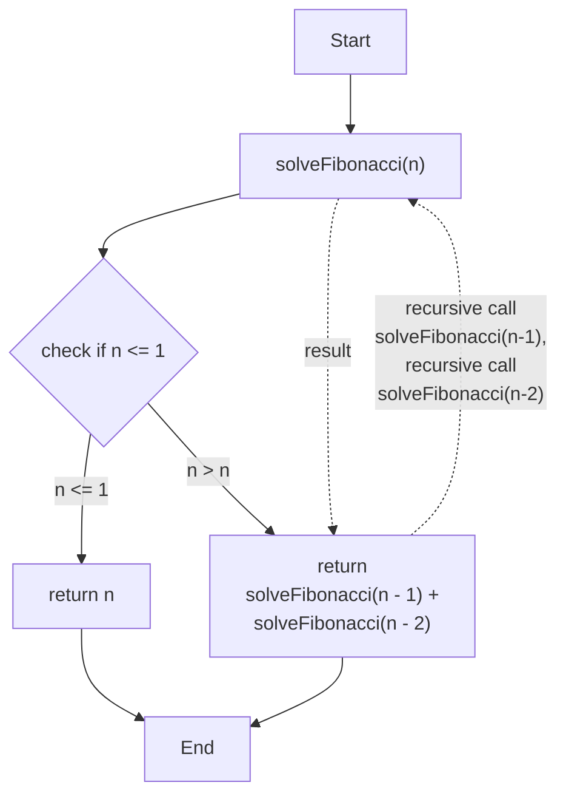
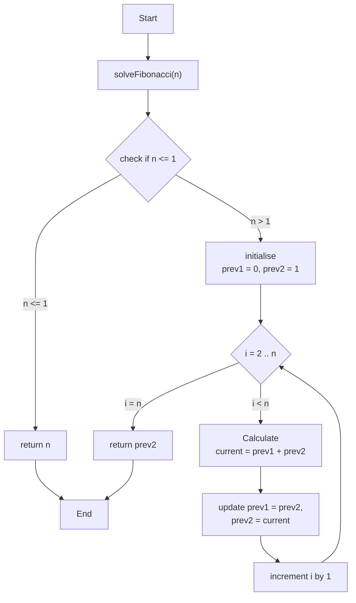
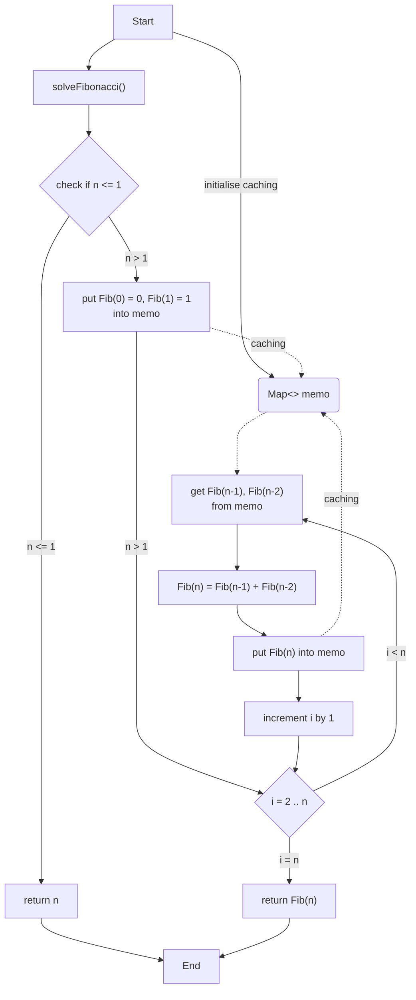
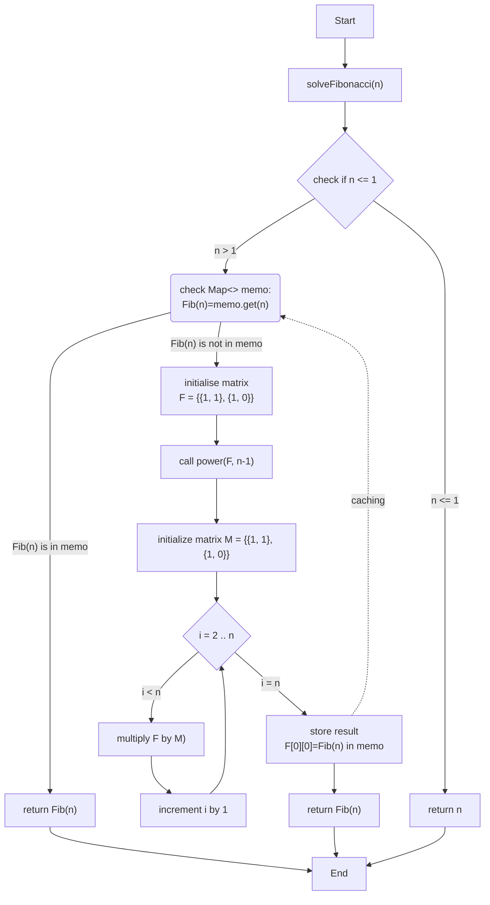
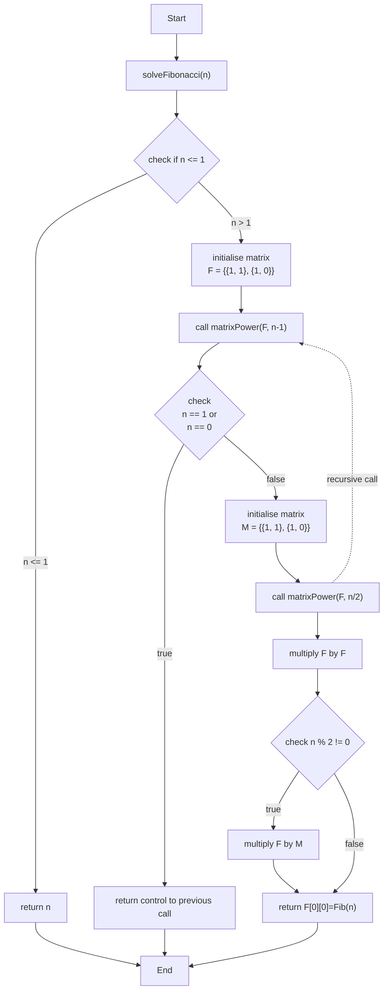

## Recursive Approach to Fibonacci Sequence

- **Time complexity**: `O(2^n)`
- **Space complexity**: `O(n)`

The primary approach used here is recursion, where the function calls itself to break down the problem into smaller subproblems. The algorithm is a basic implementation that demonstrates the concept of recursion by calculating Fibonacci numbers through repeated function calls. It's an illustrative example of recursion but not an efficient one for large inputs.
- Base Case: The function checks if `n` is less than or equal to 1 and returns the result directly. This operation takes constant time - O(1).
- Recursive Case: The number of operations required to compute the `n`-th Fibonacci number doubles with each additional level in the recursion tree. This is because each call to `solveFibonacci(n)` results in two more calls for `solveFibonacci(n - 1)` and `solveFibonacci(n - 2)`. Therefore, the time complexity of the `solveFibonacci` function in this case is `O(2^n)`.

The space complexity is determined by the maximum depth of the recursion tree. In the worst case, the maximum depth of the recursion is `n`, since each recursive call decreases `n` by 1.

## Iterative Approach to Fibonacci Sequence

- **Time complexity**: `O(n)`
- **Space complexity**: `O(1)`

The algorithm is an efficient implementation that calculates Fibonacci numbers iteratively, avoiding the exponential time complexity and stack overhead of the recursive approach. This makes it suitable for computing large Fibonacci numbers efficiently.

- Base Case: The function checks if `n` is less than or equal to 1 and returns the result directly. This operation takes constant time - `O(1)`.
- Loop: The for loop runs from `i = 2` to `i = n`, which means it iterates `n−1` times. Each iteration involves a constant amount of work — specifically, adding two `BigDecimal` numbers and performing some assignments. 

Since the loop iterates `O(n)` times and each iteration does `O(1)` work, the overall time complexity is `O(n)`.

The algorithm uses a constant number of `BigDecimal` variables (`prev1`, `prev2`, and `current`). The space required by these variables does not depend on `n`. It remains constant regardless of the size of `n`.
Unlike the recursive approach, so there's no additional space required for a call stack. Thus, the space complexity is `O(1)`.

## Dynamic Programming with Bounded Memoization for Fibonacci Sequence

- **Time complexity**: `O(n)`
- **Space complexity**: `O(1)`

This algorithm uses dynamic programming with memoization. However, due to the limit imposed on the memoization map size, it mimics the behavior of an iterative approach with space optimization, where only a few recent Fibonacci numbers are stored. By limiting the map size, the algorithm keeps space usage minimal, similar to a purely iterative approach with constant space complexity, which also allows to calculate Fibonacci number for large index `n`.

- Base Case: The function checks if `n` is less than or equal to 1 and returns the result directly. This operation takes constant time - `O(1)`.
- Loop: The for loop runs from `i = 2` to `i = n`, which means it iterates `n−1` times. Each iteration involves: Retrieving values from the `memo` map (which is typically `O(1)` for a `LinkedHashMap`). Performing an addition operation on `BigDecimal` numbers (which takes `O(1)` time assuming the number of digits in the Fibonacci numbers remains reasonably small).

Since the loop iterates `O(n)` times and each iteration does `O(1)` work, the overall time complexity is `O(n)`.

The space complexity - `O(1)`,  is determined by the amount of memory used by the algorithm.
- Memoization Map: The map `memo` is used to store intermediate Fibonacci values. However, due to the override of the `removeEldestEntry` method, the map can store at most 5 entries at any time. This means the space used by the map is constant, `O(1)`, because the size of the map does not grow with `n`.
- Other Variables: Apart from the memoization map, the algorithm uses a constant number of variables (`previousFib`, `twoStepsBackFib`) that do not depend on `n` and hence contribute to constant space.

## Matrix Exponentiation for Fibonacci Sequence

- **Time complexity**: `O(n)`
- **Space complexity**: `O(1)`

This algorithm uses matrix exponentiation to compute the n-th Fibonacci number efficiently in linear time.

- Base Case: If `n <= 1`, the function returns the result directly in `O(1)` time.
- Memoization Check: The function checks a `memo` map for precomputed results in `O(1)` time.
- Matrix Exponentiation: The core is raising a 2x2 matrix to the power of `n-1` using `power(F, n-1)`. The multiplication is done n-1 times, each in `O(1)` for fixed-size matrices, leading to `O(n)` overall time complexity.

The space complexity remains `O(1)` due to:

- Memoization Map: Stores a limited number of values.
- Matrix Storage: Uses fixed-size 2x2 matrices.

## Matrix Exponentiation with Recursive Divide and Conquer Approach

- **Time complexity**: `O(log n)` - due to the logarithmic depth of the recursive calls.
- **Space complexity**: `O(log n)` - results from the space consumed by the recursive call stack.

The core technique used in this algorithm is matrix exponentiation. The Fibonacci sequence is calculated by raising a specific 2x2 matrix to the power of `n-1`, where `n` is the Fibonacci number's index.

The algorithm uses a divide and conquer strategy to efficiently perform matrix exponentiation. The `matrixPower` function reduces the problem size by half with each recursive call (via `n >> 1` or `n/2`), leading to `O(log n)` recursive calls.

Each recursive step involves a constant-time `O(1)` matrix multiplication, as it involves only a fixed number of operations (multiplying and adding elements) for the 2x2 matrices. Given that the recursion occurs in `O(log n)`, the overall time complexity is `O(log n)`.

The space complexity is dictated by the recursion depth, with each recursive call consuming stack space. Consequently, the space complexity due to the call stack is `O(log n)`. The matrices F and M are of fixed size (2x2), requiring constant space, i.e., `O(1)`.

