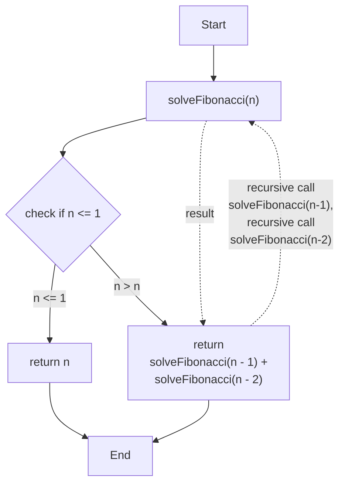
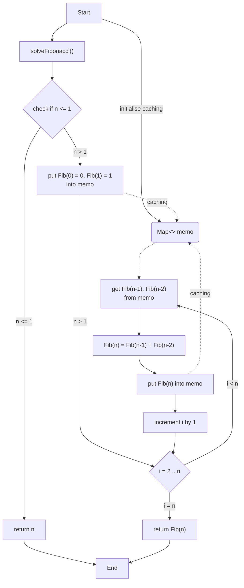
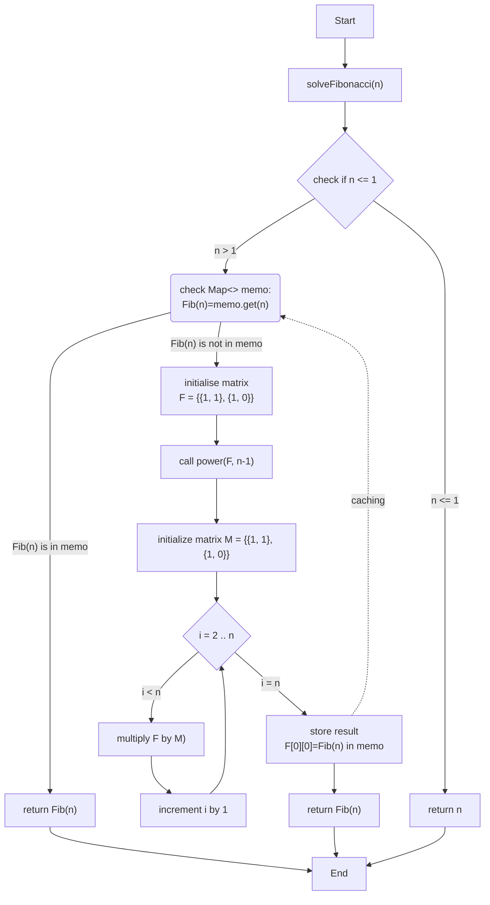

## Recursive

- **Time complexity**: `O(2^n)`
- **Space complexity**: `O(n)`

## Iterative

- **Time complexity**: `O(n)`
- **Space complexity**: `O(1)`

## Dynamic programming

- **Time complexity**: `O(n)`
- **Space complexity**: `O(n)`

## Matrix exponentiation

- **Time complexity**: `O(n)`
- **Space complexity**: `O(n)`

## Matrix Exponentiation with Recursive Divide and Conquer Approach

- **Time complexity**: `O(log n)` - due to the logarithmic depth of the recursive calls.
- **Space complexity**: `O(log n)` - results from the space consumed by the recursive call stack.

The core technique used in this algorithm is matrix exponentiation. The Fibonacci sequence is calculated by raising a specific 2x2 matrix to the power of `n-1`, where `n` is the Fibonacci number's index.

The algorithm uses a divide and conquer strategy to efficiently perform matrix exponentiation. The `matrixPower` function reduces the problem size by half with each recursive call (via `n >> 1` or `n/2`), leading to `O(logn)` recursive calls.

Each recursive step involves a constant-time `O(1)` matrix multiplication, as it involves only a fixed number of operations (multiplying and adding elements) for the 2x2 matrices. Given that the recursion occurs in `O(log n)`, the overall time complexity is `O(log n)`.

The space complexity is dictated by the recursion depth, with each recursive call consuming stack space. Consequently, the space complexity due to the call stack is `O(log n)`. The matrices F and M are of fixed size (2x2), requiring constant space, i.e., `O(1)`.

